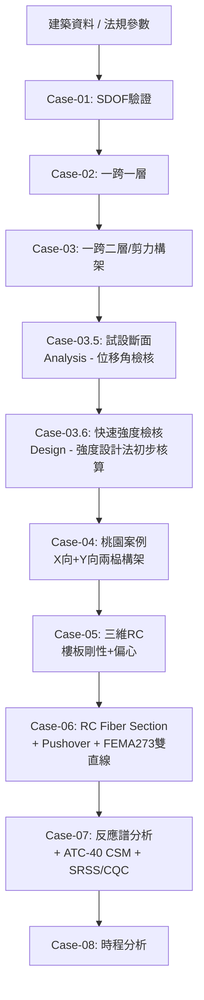

# ROADMAP

本 repo 的定位:**回答「依照台灣耐震設計流程,可以完整重現並驗證嗎?」**

姐妹專案 [reproducible-structural-benchmarks](https://github.com/zhixiu0223/reproducible-structural-benchmarks)
定位不同、互不重疊:它回答「分析引擎(OpenSeesPy/FRAME3DD/CalculiX/suanPan)本身算得對不對」,
用的是已知答案的標竿案例(Ziemian & Ziemian 等),不涉及台灣法規。

兩個專案是**上下游關係**:
`reproducible-structural-benchmarks` 提供「這套分析工具可信」的基礎,
`taiwan-seismic-code-calc` 建立在這個基礎上,重現「建築資料 → 法規計算 → 建模 → 驗算」的完整流程。

---

## 核心原則:漸進式驗證,不一開始就衝大模型

> 越大的模型,越不知道錯在哪。

每一個 Case 都要能獨立驗證、獨立當作教學節點,而不是只有最後一個大模型。
新的 Case 只允許在前一個 Case **完全驗證通過**之後才開始,不允許同時展開多條戰線。
**已經 PASS 封存的 Case 不回頭修改**——新功能永遠開新 Case,不是回去改舊的。

## Analysis 與 Design 的區分(每個 Case 開頭需標明)

- **Analysis(分析驗證)**:給定斷面/材料性質,驗證「模型算得對不對」。
  Case-01、02、03 全部屬於這類——Ic、Ib 都是抽象數字,不代表任何真實設計。
- **Design(設計檢核)**:給定需求(地震力、位移限值、強度限值),
  決定「斷面該多大」。Case-03.5、03.6 屬於這類。
- **這個區分不是形式,是提醒讀者**:Case-03.5/03.6 選出的斷面是
  **分析模型用的初始斷面(initial analysis section)**,不是最終施工圖
  的設計尺寸(final design section)——後面還有配筋、強柱弱梁、接頭設計
  等完整流程沒有走完。

---

## 整體流程圖

---

## Case 序列

### Case-01:單自由度(SDOF)—— **[已完成]**
- **Analysis**。驗證最基礎的動力學關係(F=Ku、T=2π√(m/K))
- `notebooks/case01_sdof.ipynb` —— 特徵值分析週期與靜力位移皆與
  手算閉合解完全吻合(相對誤差 0.00e+00)

### Case-02:一跨一層 —— **[已完成]**
- **Analysis**。第一次讓側向勁度從真實幾何/斷面性質算出來(位移法/
  slope-deflection 閉合解),而不是憑空給定
- `notebooks/case02_one_bay_one_story.ipynb` —— 位移與柱底彎矩皆與
  手算吻合(相對誤差 ~1e-10),含結構視覺化(幾何/載重/變形圖)

### Case-03:一跨二層 —— **[已完成]**
- **Analysis**。第一次出現「樓層」概念,剪力構架假設,2 自由度
  特徵值問題,直接沿用 Case-02 驗證過的「梁→無限剛極限值」當作
  樓層剛度,不是重新假設
- `notebooks/case03_one_bay_two_story.ipynb` —— 兩個模態週期與樓層
  位移皆與手算精確解吻合(浮點精度等級),含模態振型視覺化

### Case-03.5:試設斷面(Trial Sizing) —— **[已完成]**
- **Design**(產出 initial analysis section,非 final design section)
- 從桃園案例整棟樓 F1/F2,假設 Y 向 4 榀構架平均分攤,算出單榀
  構架分擔力(明確標注此為簡化假設,待 Case-05 驗證)
- 三輪試設迭代:18cm(FAIL)→ 20cm(PASS但margin僅20%)→
  40cm(PASS且有餘裕,選為最終值)
- **只檢核了層間位移角,完全沒檢核強度**——這正是 Case-03.6 要補的缺口
- `notebooks/case03_5_trial_sizing.ipynb`

### Case-03.6:快速強度檢核 —— **待辦(下一步)**
- **Design**。補上 Case-03.5 完全沒做的強度檢核:軸力、彎矩、剪力
  是否滿足規範的強度設計法(依《結構混凝土設計規範》,對應美規
  ASD/LRFD 的概念,但用詞依台灣規範第 374-1 條——強度設計法/
  工作應力設計法,不直接借用美規鋼結構術語)
- 寫成可重用的函式:輸入候選斷面清單(例如 20/25/30/35/40cm),
  自動建模、分析、輸出每個候選的位移角 PASS/FAIL + 強度 PASS/FAIL
  + 餘裕百分比,不是像 Case-03.5 那樣手動挑 3 個數字
- **需要額外文件**:目前只有《建築技術規則建築構造編》,裡面第 332
  條把實際的強度設計公式、φ 折減係數、最小配筋率委任給《結構混凝土
  設計規範》(內政部另訂,類似台灣版 ACI 318)——這份文件目前手上
  沒有,若要讓這一步的數字真正對得上規範,需要另外找來上傳

### Case-04:三跨二層(桃園案例)
- 法規計算部分(SDS/SD1/V/F1/F2/反曲點法概估)已完成,見
  `notebooks/seismic_design_2story_8col.ipynb`
- 待補:把 Case-02/03 的建模方法真正套進桃園案例的兩個方向
  (X 向 3 跨、Y 向 1 跨),用 Case-03.6 通過強度+位移雙重檢核的
  斷面,跑出真實位移,跟第 15 課反曲點法概估值比對

### Case-05:三維 RC
- 加入 X 方向、Y 方向、樓板剛性假設、質量偏心(含規範規定的 5%
  意外偏心)——這裡才驗證 Case-03.5/03.6 用過的「4 榀構架平均分攤」
  假設是否成立

### Case-06:RC Fiber Section + Pushover + FEMA 273
- 引入 Fiber Section(Concrete01、Steel02)取代彈性梁柱元素,這一步
  隱含了完整配筋設計與強柱弱梁檢核,是 Design 這條線真正的終點
- 跑側推分析得到桃園案例真實的 Pushover 曲線,套 FEMA 273 等面積
  雙直線法算出真正的 Vy、Keff、Teff

### Case-07:反應譜分析 + ATC-40 CSM
- 把 Case-06 的 Pushover 曲線轉換到 ADRS 座標,疊上桃園案例真實
  需求譜找性能點
- 同時實作 SRSS 與 CQC 多振態組合對比

### Case-08:時程分析
- 加入實際地震歷時,驗證等值靜力法與反應譜法的簡化誤差有多大
- 額外方法論驗證層,非規範強制(本案例遠低於強制動力分析門檻)

---

## FEMA 273 / ATC-40 的定位澄清

這兩份文件是美國既有建築耐震評估/補強指引(FEMA 273 已被 ASCE 41 取代),
**不是台灣新建物法定合規流程的一部分**。放進本 repo 的理由是 Case-06/07
需要一套建立 Pushover→性能點的既有方法論當骨架。之前產出的課程講義範例
用的是課程示範數字,不是桃園案例的真實數字,Case-06/07 必須用桃園案例
自己跑出來的 Pushover 曲線重新代入這套方法論才算完成。

---

## 明確不做的事(避免範圍蔓延)

- 不在 Case 完全通過前平行展開下一個 Case
- 已經 PASS 封存的 Case 不回頭修改,新功能開新 Case
- Case-05 之前不加樓板剛性以外的三維複雜度(不加牆、不加地下室)
- 不為了「更真實」而跳過中間 Case 直接做大模型
